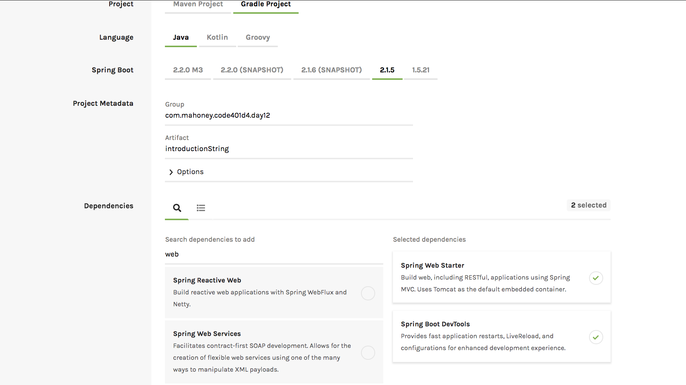

# Songr 

## Author

Liz Mahoney

## Version 

1.0.0

## Getting Started

1. Go to `https://start.spring.io/` to create a spring application.

2. Open application in IntelliJ, select used import, and select appropriate JDK, click ok

3. On terminal in root directory run `git init`
3. Create a repo on github named `Songr`, then initial ACP to the Songr repo on github

***To Run Application***

In terminal run: `./gradlew bootrun`

***To view gradle commands***

In terminal run: `./gradlew tasks`

***To Run Test***

In terminal run: `./gradlew test`

## Features

### 6/12/19

- [x] Ensure that you can run the Spring app.
- [x] Create a hello world route at /hello, and ensure that you can visit that route in your browser and see data come back.
- [x] Create a route that turns words into UPPER CASE. For instance, I should be able to visit /capitalize/hello and get back the response HELLO, or I could visit /capitalize/this is Kinda Capitalized and get the response THIS IS KINDA CAPITALIZED.
- [x] Write a unit test for the capitalization functionality of that route.
- [x] Create a route that reverses the order of the words in a query parameter. For example, if I visit /reverse?sentence=Hello world, it should return world Hello.
- [x] Write a unit test for the word reversing functionality of the above route.
